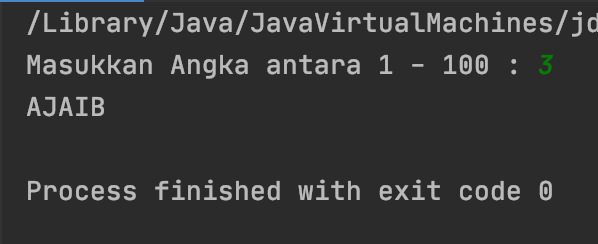
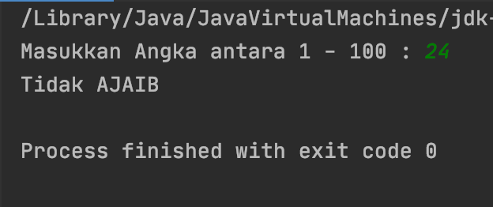

# Check Even or Odd
##### Introduction to programming
##### SESSION 5 - Selection (OL) #3


Jika diberikan suatu bilangan bulat (n) dan syarat berikut:
- Jika n ganjil, cetak "AJAIB".
- Jika n genap dan masih dalam rentang 2 - 5, cetak "Tidak AJAIB".
- Jika n genap dan masih dalam rentang 6 - 20, cetak "AJAIB".
- Jika n genap dan lebih besar dari 20, cetak "Tidak AJAIB".

Note: hanya untuk bilangan bulat positif Integer antara 1 - 100.


```java
package id.bagaswirapradana.i2p;

import java.util.Scanner;

public class Main {

    public static void main(String[] args) {
        int value;
        
        Scanner masukan = new Scanner(System.in);
        System.out.print("Masukkan Angka antara 1 - 100 : ");
        
        if (!masukan.hasNextInt()) {
            System.out.println("Data yang dimasukkan hanya bisa berupa bilangan bulat saja.");
            masukan.close();
        }

        value = masukan.nextInt();
        if (value < 1 || value > 100) {
            System.out.println("Data yang dimasukkan harus dalam rentang dari 1 sampai 100.");
        } else {
            System.out.println(value % 2 != 0 || value >= 6 && value <= 20 ? "AJAIB" : "Tidak AJAIB");
        }
        masukan.close();
    }
}
```


*Test Case 1*



*Test Case 2*


